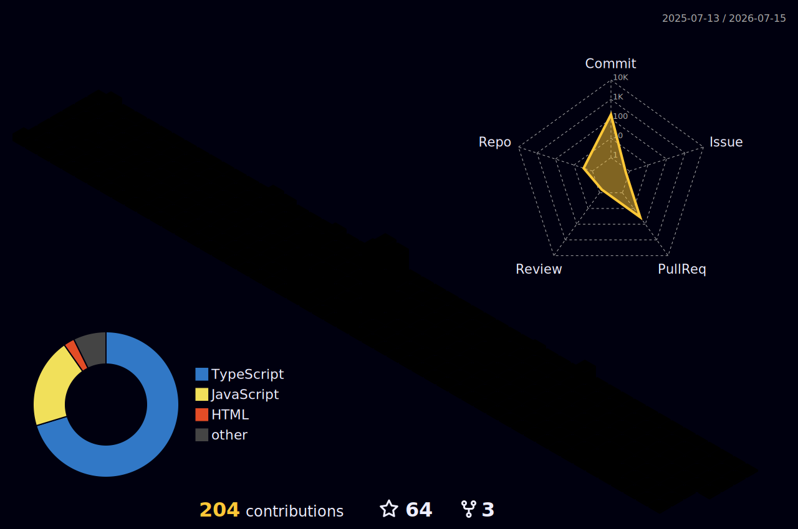

<!-- ============================================================
     PASINDU PATHUM — NEXT-LEVEL FUTURISTIC README
     ============================================================ -->

<div align="center">

<!-- CINEMATIC HEADER -->


</div>

<!-- ANIMATED TERMINAL LINES -->
<p align="center">

</p>

<p align="center">

</p>


---

## `$ cat /proc/developer`

<div align="center">

<table>
<tr>
<td valign="top" width="55%">

```typescript
// developer.config.ts

interface Developer {
  name:       "Pasindu Pathum"
  alias:      "GAP-Pathum"
  role:       "Full Stack Engineer"
  location:   "Sri Lanka 🇱🇰  · UTC+5:30"
  philosophy: "Precision over noise, always."

  languages:  ["JS", "TS", "PHP", "Java", "SQL"]
  frontend:   ["React", "Tailwind CSS", "AJAX"]
  backend:    ["Node.js", "Express", "PHP MVC"]
  databases:  ["MySQL", "Firebase", "Firestore"]
  toolchain:  ["Git", "Figma", "Postman", "VS Code"]

  currentFocus: [
    "REST API Architecture",
    "Real-time Firebase Systems",
    "Secure Auth Flows",
    "Cloud & Microservices",
  ]

  openTo: "Freelance · OSS · Wild ideas"
}

export default Developer satisfies config ✓
```

</td>
<td valign="top" width="45%">


<br/>


</td>
</tr>
</table>

</div>

---

## `$ neofetch --stack`

<div align="center">

<table>
<tr>
<td align="center" width="25%">

**◈ FRONTEND**


</td>
<td align="center" width="25%">

**◈ BACKEND**


</td>
<td align="center" width="25%">

**◈ DATABASE**


</td>
<td align="center" width="25%">

**◈ TOOLS**


</td>
</tr>
</table>

</div>

---

## `$ htop` — Skill Profiler

```
  PID  PROCESS                    THREADS   CPU%  MEM    STATUS
  ───────────────────────────────────────────────────────────────
  001  JavaScript / TypeScript    ▰▰▰▰▰▰▰▰▰▰▰▰▰  98%  HIGH   ● RUNNING
  002  Node.js / Express          ▰▰▰▰▰▰▰▰▰▰▰▰░  95%  HIGH   ● RUNNING
  003  MySQL / Relational DB      ▰▰▰▰▰▰▰▰▰▰▰▰░  93%  HIGH   ● RUNNING
  004  React + Tailwind CSS       ▰▰▰▰▰▰▰▰▰▰▰░░  90%  MED    ● RUNNING
  005  REST API Design            ▰▰▰▰▰▰▰▰▰▰▰▰░  92%  HIGH   ● RUNNING
  006  Firebase / Firestore       ▰▰▰▰▰▰▰▰▰▰▰░░  87%  MED    ● RUNNING
  007  PHP MVC Architecture       ▰▰▰▰▰▰▰▰▰▰░░░  85%  MED    ● RUNNING
  008  UI/UX + Figma              ▰▰▰▰▰▰▰▰▰░░░░  80%  MED    ● RUNNING
  009  Docker / Containers        ▰▰▰▰▰░░░░░░░░  42%  LOW    ↻ LEARNING
  010  AWS / Cloud Infra          ▰▰▰▰░░░░░░░░░  35%  LOW    ↻ LOADING
  011  AI / ML Integration        ▰▰▰░░░░░░░░░░  28%  LOW    ⏳ QUEUED
  ───────────────────────────────────────────────────────────────
  Load: ████████░░  |  Uptime: 3+ yrs  |  Mode: Full Stack  |  Threads: ∞
```

---

## `$ ls -R ./missions/`

<div align="center">

<table>
<tr>
<td width="50%" valign="top">

**`./active/`**
```bash
🔥  rest-api-architecture
    └─ Versioned, scalable, documented

⚡  realtime-firebase-systems
    └─ Live sync + event-driven flows

🎨  modern-ui-component-libs
    └─ Design tokens + Storybook

🔐  secure-auth-flows
    └─ JWT · OAuth · Session hardening
```

</td>
<td width="50%" valign="top">

**`./unlocking/`**
```bash
☁️  cloud-infrastructure
    └─ AWS · Serverless · CDN strategies

🐳  docker-containerization
    └─ Compose · Registry · CI pipelines

📊  data-visualization
    └─ Dashboards · Real-time charts

🤖  ai-integration
    └─ LLMs in prod · RAG · Embeddings
```

</td>
</tr>
</table>

</div>

---

## `$ git log --pretty="oneline" --graph`

<div align="center">


</div>

---

## `$ cat /var/log/achievements.log`

<div align="center">


</div>

---

## `$ contrib --3d --view=night`

<div align="center">



</div>

---

## `$ watch -n 1 git log --oneline`

<picture>
  <source media="(prefers-color-scheme: dark)" srcset="https://raw.githubusercontent.com/GAP-Pathum/GAP-Pathum/output/github-contribution-grid-snake-dark.svg">
  <source media="(prefers-color-scheme: light)" srcset="https://raw.githubusercontent.com/GAP-Pathum/GAP-Pathum/output/github-contribution-grid-snake.svg">
  
</picture>

---

## `$ echo $QUOTE`

<div align="center">

> **"Make it work. Make it right. Make it fast. In that order."**
> *— Kent Beck*

<br/>

> **"The best error message is the one that never shows up."**
> *— Thomas Fuchs*

</div>

---

## `$ ping --connect pasindu`

<div align="center">

<p>
  <a href="https://gappathum-portfolio.netlify.app/">
    
  </a>
  &nbsp;
  <a href="https://github.com/GAP-Pathum">
    
  </a>
  &nbsp;
  <a href="https://www.linkedin.com/in/pasindu-pathum-98a299249/">
    
  </a>
</p>

<p>
  <a href="https://stackoverflow.com/users/23304284">
    
  </a>
  &nbsp;
  <a href="https://www.behance.net/pasindupathum">
    
  </a>
  &nbsp;
  <a href="https://www.instagram.com/g_a_p_pathum">
    
  </a>
</p>

<br/>


&nbsp;

&nbsp;


</div>

---

<div align="center">


</div>
